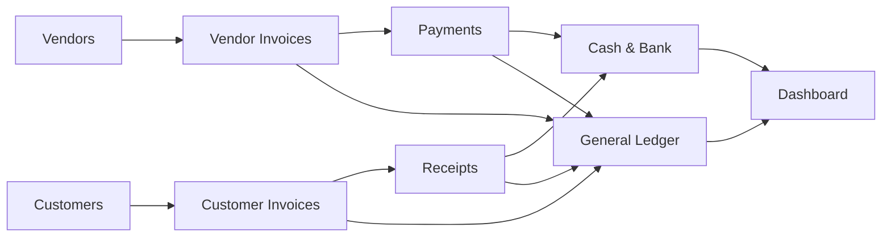
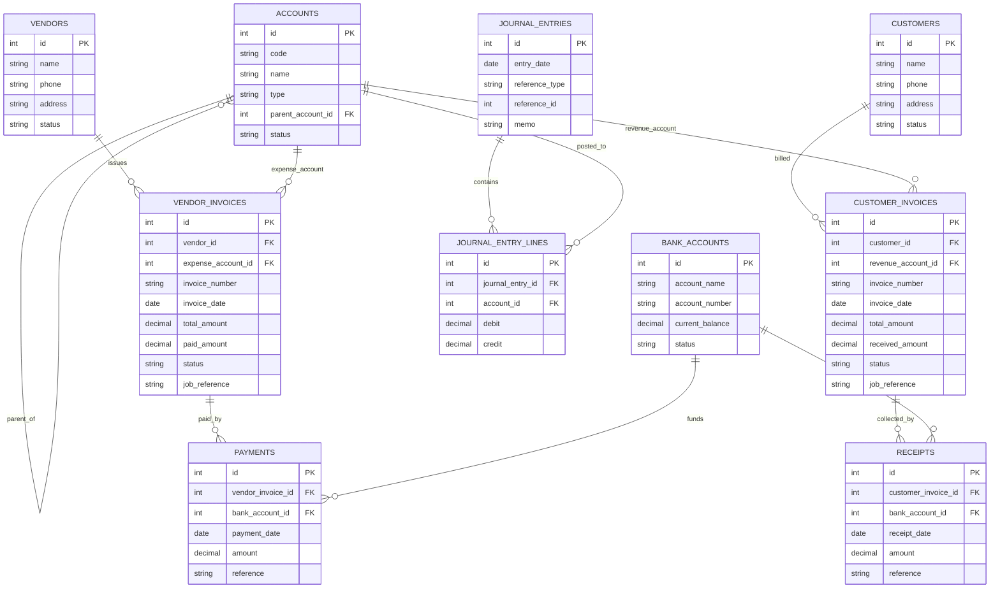
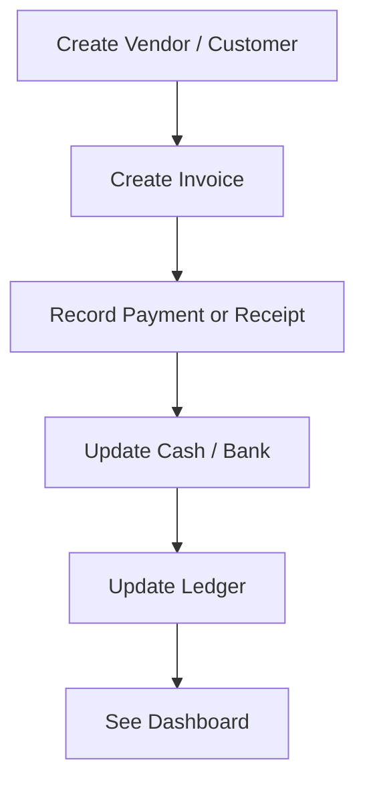

# Barebones Accounting Visual Diagram

## 1. High-Level Workflow

## 2. Barebones MVP ERD

### ERD Explanation

- `ACCOUNTS`: The main ledger accounts used in bookkeeping, such as Cash, Accounts Payable, Sales, or Office Expense.
- `ACCOUNT_TYPES`: In your image version, this is the parent classification for accounts like Asset, Liability, Equity, Revenue, and Expense. In this simplified file, account type is stored directly on `ACCOUNTS`.
- `VENDORS`: Stores supplier records for parties the business buys from.
- `CUSTOMERS`: Stores customer records for parties the business sells to.
- `BANK_ACCOUNTS`: Represents cash and bank accounts where money is paid from or received into.
- `VENDOR_INVOICES`: Purchase bills received from vendors. These increase what the business owes.
- `CUSTOMER_INVOICES`: Sales bills issued to customers. These increase what customers owe the business.
- `PAYMENTS`: Money paid against vendor invoices. These reduce payables and reduce cash/bank balance.
- `RECEIPTS`: Money received against customer invoices. These reduce receivables and increase cash/bank balance.
- `JOURNAL_ENTRIES`: The accounting transaction header. Each business action can create one journal entry.
- `JOURNAL_ENTRY_LINES`: The debit and credit lines inside a journal entry. These are the actual postings to accounts.

### Relationship Explanation

- `VENDORS -> VENDOR_INVOICES`: One vendor can have many purchase invoices.
- `CUSTOMERS -> CUSTOMER_INVOICES`: One customer can have many sales invoices.
- `ACCOUNTS -> VENDOR_INVOICES`: Each vendor invoice is assigned to an expense-related account.
- `ACCOUNTS -> CUSTOMER_INVOICES`: Each customer invoice is assigned to a revenue-related account.
- `VENDOR_INVOICES -> PAYMENTS`: One invoice can be paid in one or multiple payments.
- `CUSTOMER_INVOICES -> RECEIPTS`: One invoice can be collected in one or multiple receipts.
- `BANK_ACCOUNTS -> PAYMENTS`: Payments are made from a specific bank or cash account.
- `BANK_ACCOUNTS -> RECEIPTS`: Receipts are deposited into a specific bank or cash account.
- `JOURNAL_ENTRIES -> JOURNAL_ENTRY_LINES`: One journal entry contains multiple debit/credit lines.
- `ACCOUNTS -> JOURNAL_ENTRY_LINES`: Each journal line posts money to one ledger account.

### How To Explain This To A Client

- First we create the list of accounts.
- Then we create vendors and customers.
- When an invoice is created, the system knows who it belongs to and which account it affects.
- When payment or receipt happens, cash/bank is updated.
- Behind the scenes, journal entries keep the accounting correct.

## 3. Client-Friendly Version

