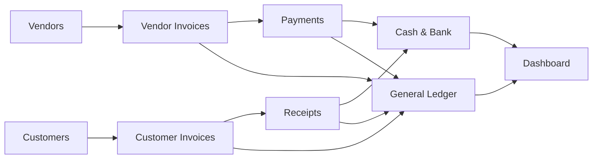
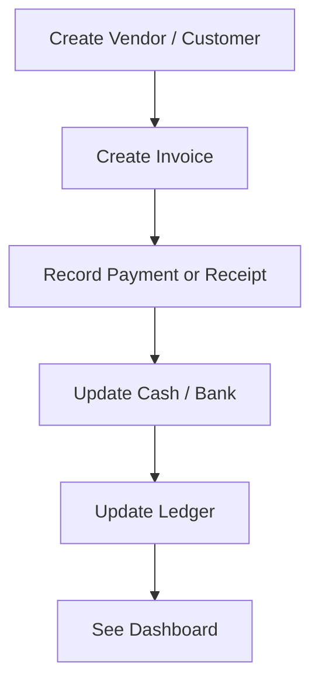

# Barebones Accounting Visual Diagram

## 1. High-Level Workflow

```mermaid
flowchart LR
    V[Vendors] --> VI[Vendor Invoices]
    C[Customers] --> CI[Customer Invoices]
    VI --> P[Payments]
    CI --> R[Receipts]
    P --> B[Cash & Bank]
    R --> B
    VI --> GL[General Ledger]
    CI --> GL
    P --> GL
    R --> GL
    B --> D[Dashboard]
    GL --> D
```

## 2. Barebones MVP ERD

```mermaid
erDiagram
    ACCOUNTS {
        int id PK
        string code
        string name
        string type
        int parent_account_id FK
        string status
    }

    VENDORS {
        int id PK
        string name
        string phone
        string address
        string status
    }

    CUSTOMERS {
        int id PK
        string name
        string phone
        string address
        string status
    }

    BANK_ACCOUNTS {
        int id PK
        string account_name
        string account_number
        decimal current_balance
        string status
    }

    VENDOR_INVOICES {
        int id PK
        int vendor_id FK
        int expense_account_id FK
        string invoice_number
        date invoice_date
        decimal total_amount
        decimal paid_amount
        string status
        string job_reference
    }

    CUSTOMER_INVOICES {
        int id PK
        int customer_id FK
        int revenue_account_id FK
        string invoice_number
        date invoice_date
        decimal total_amount
        decimal received_amount
        string status
        string job_reference
    }

    PAYMENTS {
        int id PK
        int vendor_invoice_id FK
        int bank_account_id FK
        date payment_date
        decimal amount
        string reference
    }

    RECEIPTS {
        int id PK
        int customer_invoice_id FK
        int bank_account_id FK
        date receipt_date
        decimal amount
        string reference
    }

    JOURNAL_ENTRIES {
        int id PK
        date entry_date
        string reference_type
        int reference_id
        string memo
    }

    JOURNAL_ENTRY_LINES {
        int id PK
        int journal_entry_id FK
        int account_id FK
        decimal debit
        decimal credit
    }

    ACCOUNTS ||--o{ ACCOUNTS : parent_of
    VENDORS ||--o{ VENDOR_INVOICES : issues
    CUSTOMERS ||--o{ CUSTOMER_INVOICES : billed
    ACCOUNTS ||--o{ VENDOR_INVOICES : expense_account
    ACCOUNTS ||--o{ CUSTOMER_INVOICES : revenue_account
    VENDOR_INVOICES ||--o{ PAYMENTS : paid_by
    CUSTOMER_INVOICES ||--o{ RECEIPTS : collected_by
    BANK_ACCOUNTS ||--o{ PAYMENTS : funds
    BANK_ACCOUNTS ||--o{ RECEIPTS : receives
    JOURNAL_ENTRIES ||--o{ JOURNAL_ENTRY_LINES : contains
    ACCOUNTS ||--o{ JOURNAL_ENTRY_LINES : posted_to
```

## 3. Client-Friendly Version

```mermaid
flowchart TD
    A[Create Vendor / Customer] --> B[Create Invoice]
    B --> C[Record Payment or Receipt]
    C --> D[Update Cash / Bank]
    D --> E[Update Ledger]
    E --> F[See Dashboard]
```
